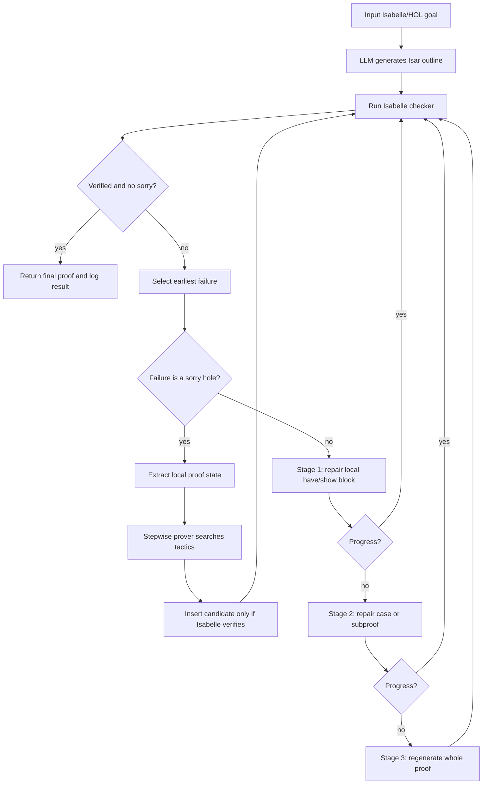

# Planner-Fill-Repair Workflow

Use this as the basis for the report figure.

The loop is deliberately top-down: every iteration fixes the earliest Isabelle failure before touching later proof text.

